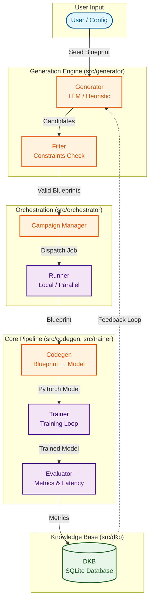

<div align="center">

# 🧬 AI That Invents AI

### Self-Evolving Neural Architecture System

[](https://www.python.org/)
[](https://pytorch.org/)
[](LICENSE)

**Automated neural architecture synthesis through evolutionary design**

[Features](#-features) • [Installation](#-installation) • [Quick Start](#-quick-start) • [Architecture](#-architecture) • [Examples](#-examples)

</div>

---

## 📋 Overview

**AI That Invents AI** is a research‑grade, self‑evolving neural architecture system. It goes beyond traditional AutoML by introducing explicit reasoning, memory, and evolution intelligence into the architecture design loop.

Unlike systems that blindly search architectures, this project understands, critiques, and improves its own designs over time.

### 🎯 Pipeline Flow

```
Blueprint (JSON/DSL) → Validation → PyTorch Model → Training → Evaluation → Metrics Report
```

---

## 🏗️ Architecture

### 🔄 System Workflow



### Core Components

#### 🎨 **Blueprint System**
Defines neural architecture in declarative JSON format:
```json
{
  "input_shape": [3, 32, 32],
  "num_classes": 10,
  "layers": [
    {"type": "conv", "filters": 64, "kernel": 3},
    {"type": "pool", "size": 2}
  ]
}
```

#### 🔧 **Renderer**
Converts blueprints to executable PyTorch models with automatic shape inference and layer composition.

#### ✅ **Validator**
Ensures architectural integrity through forward pass simulation and constraint checking.

#### 📊 **Evaluator**
Measures model quality across multiple dimensions:
- **Accuracy**: Classification performance
- **Latency**: Inference speed (CPU/GPU)
- **FLOPs**: Computational complexity
- **Parameters**: Model size

---

## ✨ Features

### 🏗️ Phase‑1 — Architecture MVP (Completed)
- JSON / DSL‑based architecture blueprints
- Blueprint → PyTorch model code generation
- Shape & parameter validation
- Training loop with early stopping
- FLOPs, parameter count, and latency measurement
- Streamlit frontend

### 🔄 Phase‑2 — Evolution Engine (Completed)
- Constraint‑aware architecture generator
- Heuristic + LLM‑ready mutation engine
- Multi‑candidate training campaigns
- SQLite‑based Design Knowledge Base (DKB)
- Pareto‑frontier selection (accuracy × latency × params)
- Retraining of champion architectures

### 🧠 Phase‑3 — Self‑Evolving Intelligence (Completed)
Phase‑3 turns the system into a thinking AI system.

| Capability | Description |
| :--- | :--- |
| 🧬 Architecture DNA | Symbolic encoding of every network |
| 🧠 AI Critic Agent | Scores efficiency, expressiveness, stability |
| 🌳 Genealogy | Tracks parent → child mutation lineage |
| 🎯 Critic‑Driven Mutation | Mutations guided by critique |
| 📚 Evolution Memory | Reasoning + metrics stored permanently |
| 📊 Intelligence Dashboard | Visualize evolution & convergence |

---

## 📁 Project Structure

```
AI_That_Invents_AI/
├── 📂 bin/                  # CLI Entry points
│   ├── eval_checkpoint.py
│   ├── export_champion.py
│   ├── run_campaign.py      # Main entry point for evolution
│   └── ...
├── 📂 data/                 # Datasets (CIFAR-10, etc.)
├── 📂 examples/             # Seed blueprints
│   └── blueprints/
├── 📂 frontend/             # Streamlit Dashboards
│   ├── Phase1_app.py
│   ├── Phase2_app.py
│   └── Phase3_app.py        # Main EvoLab Interface
├── 📂 notebooks/            # Jupyter Notebooks for analysis
├── 📂 scripts/              # Utility scripts
├── 📂 src/                  # Source Code
│   ├── 📂 agents/           # AI Critic & Mutation Policy
│   ├── 📂 codegen/          # Blueprint -> PyTorch Code
│   ├── 📂 dkb/              # Database Client (SQLite)
│   ├── 📂 dsl/              # Domain Specific Language Parser
│   ├── 📂 eval/             # Evaluation Metrics (FLOPs, Latency)
│   ├── 📂 evolution/        # DNA & Genealogy Logic
│   ├── 📂 generator/        # Mutation & Sampling Logic
│   ├── 📂 orchestrator/     # Campaign Runner
│   ├── 📂 spec/             # JSON Schemas
│   └── 📂 trainer/          # PyTorch Training Loop
├── 📂 tests/                # Unit & Integration Tests
├── dkb.sqlite               # The Knowledge Base (Auto-generated)
├── requirements.txt         # Python Dependencies
└── README.md                # Project Documentation
```

---

## 🚀 Installation

### Prerequisites
- Python 3.8 or higher
- pip package manager

### Setup

1. **Clone the repository**
```bash
git clone https://github.com/Rohit1x52/AI_That_Invents_AI.git
cd AI_That_Invents_AI
```

2. **Create virtual environment**
```bash
python -m venv AIinventor
# Windows
.\AIinventor\Scripts\Activate.ps1
# Linux/Mac
source AIinventor/bin/activate
```

3. **Install dependencies**
```bash
pip install -r requirements.txt
```

---

## ⚡ Quick Start Examples

### 1. Train a Single Model
Run the MVP notebook to train a blueprint on CIFAR-10:
```bash
jupyter notebook notebooks/train_blueprint_mvp.ipynb
```

### 2. Run the Evolutionary Campaign
Start the evolution loop to invent new architectures:
```bash
python bin/run_campaign.py --generations 10 --population 20
```

### 3. Visualize Results
Launch the interactive dashboard to explore the genealogy:
```bash
streamlit run frontend/Phase3_app.py
```

---

## Why This Project Is Unique

Most AutoML systems:

❌ Do not explain decisions

❌ Forget past designs

❌ Cannot reason about failures

AI That Invents AI:

🧠 Explains why architectures are good or bad

🧬 Tracks evolution across generations

📚 Builds long‑term architectural memory

🎯 Adapts mutation strategies

🔁 Improves itself over time

This is AI that understands how it invents AI.

---

## 🛣️ Roadmap

| Phase | Status |
| :--- | :--- |
| **Phase‑1**: Architecture MVP | ✅ Completed |
| **Phase‑2**: Evolution Engine | ✅ Completed |
| **Phase‑3**: Self‑Evolving Intelligence | ✅ Completed |
| **Phase‑4**: Autonomous AI Researcher | 🔜 Planned |

### Phase‑4 will include:
- Hypothesis‑driven architecture generation
- Long‑horizon evolution
- Self‑written research papers

---

## 🤝 Contributing

We welcome contributions!
1. Fork the repo
2. Create a feature branch
3. Commit your changes
4. Push to the branch
5. Create a Pull Request

---

## 🙏 Acknowledgments

*   **PyTorch Team** for the flexible deep learning framework.
*   **Streamlit** for the amazing data app capabilities.
*   **MLflow** for experiment tracking.
*   **fvcore** for FLOPs computation.
*   Inspired by **"Regularized Evolution for Image Classifier Architecture Search"** (Real et al., 2019).

---

<div align="center">

**⭐ Star this repo if you find it useful!**

Made with ❤️ by Rohit Ranjan Kumar

</div>
